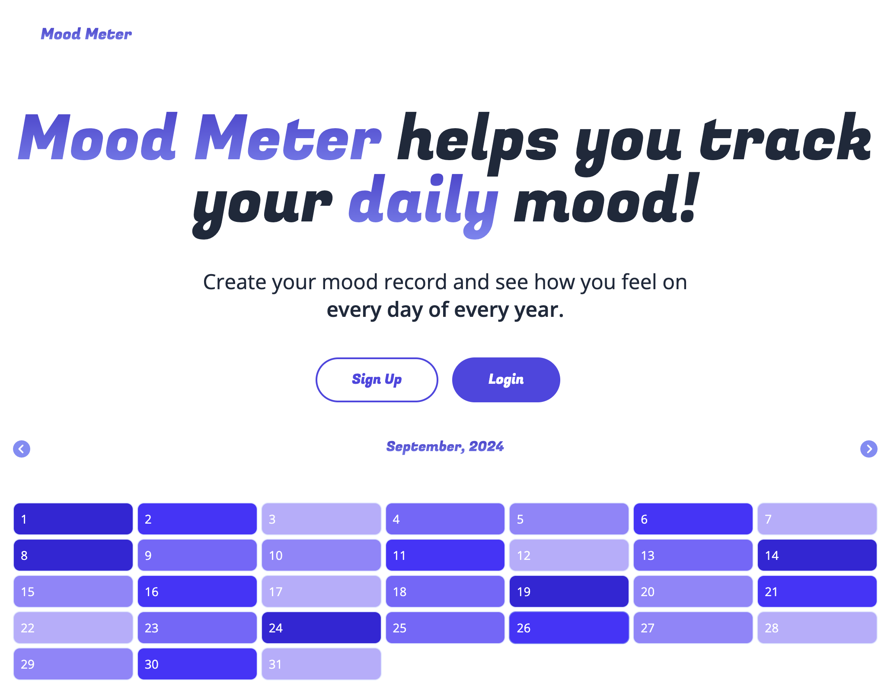

# Mood Meter

Mood Meter is a super cool, full stack mood tracking application. It helps you track your daily mood!

## Prerequisits

- NextJs
- Tailwind CSS
- Firebase

## Configuration

### Clone repository and move to app directory

- git clone https://github.com/usamabasharat/mood-meter.git
- cd mood-meter

## Enviornmenral Variables

- NEXT_PUBLIC_API_KEY
- NEXT_PUBLIC_AUTH_DOMAIN
- NEXT_PUBLIC_PROJECT_ID
- NEXT_PUBLIC_STORAGE_BUCKET
- NEXT_PUBLIC_MESSAGING_SENDER_ID
- NEXT_PUBLIC_APP_ID

## Prepare & Start Server

- `npm install`
- `npm run dev`

## App URL

- http://127.0.0.1:3000/

## Credits

- [James McArthur](https://www.linkedin.com/in/jamezmcarthur/)
